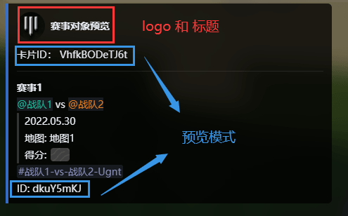
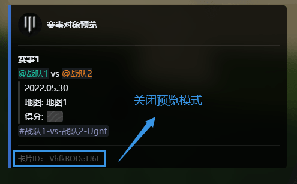

# 赛事卡片和赛事对象
:::tip
本文档中的 `赛事卡片` 和 `赛事对象` 概念第一次见可能会有点疑惑，放心在使用中您很快就能理解
:::
## 赛事对象
一个赛事对象包含赛事的一系列关键信息，并且拥有一个**唯一ID**  
赛事对象包含 `ID`，`名称`，`角色1`，`角色2`，`时间`，`地图`，`得分`，`频道` 8个信息  
`ID` 由 MatchesBot 自行生成且无法修改  
`频道` 也由 MatchesBot 自行创建（用于对战）但可以修改，也可以重新生成  
其余信息皆可自由修改  

### 赛对对象模板
其中at的角色可以用角色ID替代
```text
(name)赛事1(name)  
(role1) @战队1 (role1)  
(role2) @战队2 (role2)  
(time)2022.05.30(time)  
(map)地图1(map)  
(score)?-?(score)  
```

## 赛事卡片
一个赛事卡片包含卡片的关键信息，并且拥有一个**唯一ID**  
赛事卡片包含 `ID`，`赛事对象ID`，`预览`，`标题`，`logo` 5个信息  
`ID` 由 MatchesBot 自行生成且无法修改  
`赛事对象ID` 是一个由一系列赛事对象的ID构成的列表  
`预览` 是决定生成的卡片是否为预览模式 （明显的显示赛事卡片ID和赛事对象ID）  
`标题` 是生成的卡片的上方文本 有 `logo` 时支持 [KMarkDown](https://developer.kaiheila.cn/doc/kmarkdown)  
`logo` 是生成的卡片的上方图片


