# 指令使用说明
:::tip
指令前缀为 `.` ，下文不再说明  
`\` 代表没有参数，下文不再说明
:::
## 赛事对象相关
### 赛事对象生成
---
#### 指令说明
该指令用于生成赛事对象  
使用该指令时需要将信息填入 [赛事对象模板](./cards_and_objects.md#赛事对象模板) 然后跟在指令的下一行  
该指令支持同时生成多个赛事对象，用 `---` 换行分隔即可
#### 指令返回
一个包含所有本次生成的赛事对象的用于预览的赛事卡片
#### 使用示例
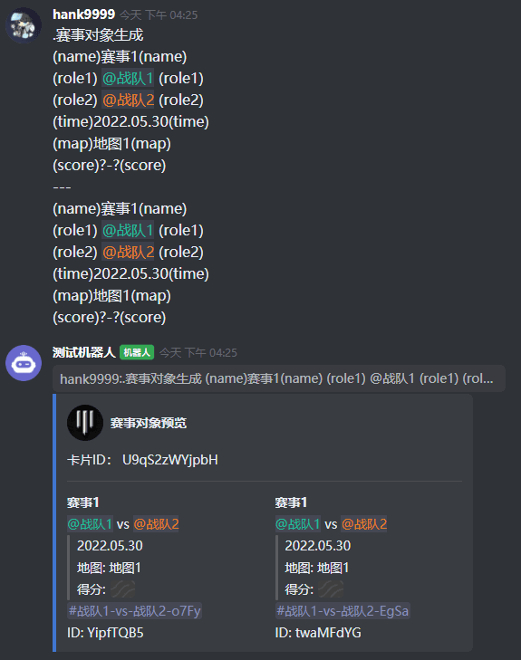

### 赛事对象列表
---
#### 指令说明
该指令用于列出所有的赛事对象
#### 指令返回
一个包含所有赛事对象的卡片  
#### 使用示例
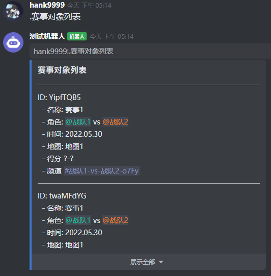

### 赛事对象删除
---
#### 指令说明
该指令用于删除指定的赛事对象  
可一次性删除多个赛事对象  
指令 + 空格 + 赛事对象ID ( + 空格 + 赛事对象ID)...
#### 指令返回
删除成功消息
#### 使用示例
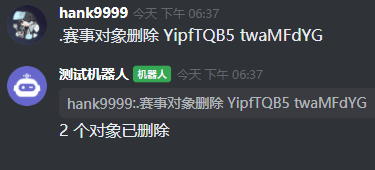

### 赛事对象全部清空
---
#### 指令说明
该指令用于删除全部的赛事对象
#### 指令返回
删除成功消息
#### 使用示例
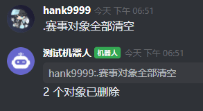

### 赛事对象修改
---
#### 指令说明
指令 + 空格 + 赛事对象ID + 关键字 ( + 内容)

| 关键词 | 内容 | 用途 |
| :-: | :-: | :-: |
| 名称 | 文本 | 设置赛事名称 |
| 角色1 | @对应角色 或者 角色ID | 设置赛事角色1 |
| 角色2 | @对应角色 或者 角色ID | 设置赛事角色2 |
| 时间 | 文本 | 设置赛事时间 |
| 地图 | 文本 | 设置赛事地图 |
| 得分 | 文本 | 设置赛事得分 |
| 频道 | 引用频道 或者 频道ID | 设置赛事频道 |
| 频道生成 | \ | 重新生成当前角色下的对战用频道 |

#### 指令返回
修改成功消息
#### 使用示例
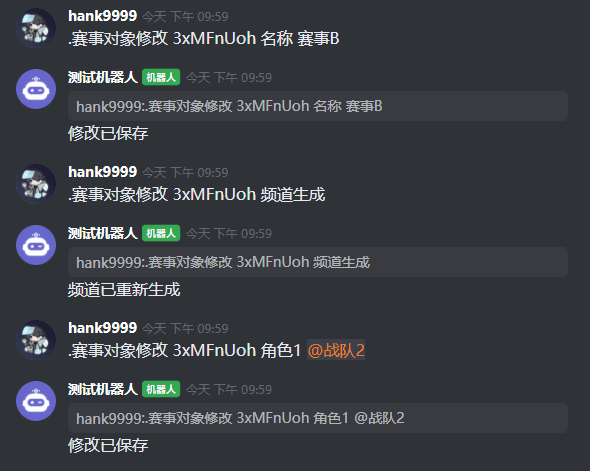

## 赛事卡片相关
### 赛事卡片生成
---
#### 指令说明
该指令用于将已存在的赛事卡片生成为开黑啦卡片消息  
有 2 种使用方式
1. 回复之前的ID相同的赛事卡片
2. 指令 + 空格 + 赛事卡片ID
#### 指令返回
赛事卡片的卡片消息
#### 使用示例
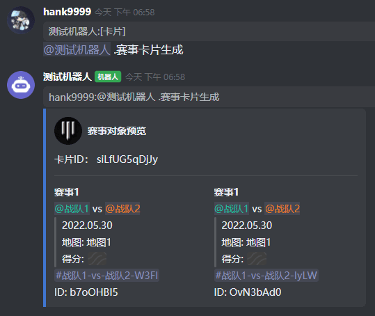
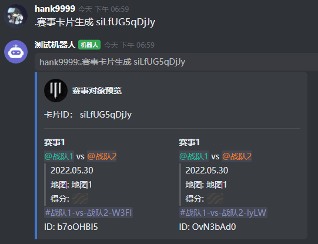

### 赛事卡片创建
---
#### 指令说明
该指令用于从赛事对象ID生成新的赛事卡片
可一次性输入多个赛事对象ID  
指令 + 空格 + 赛事对象ID ( + 空格 + 赛事对象ID)...
#### 指令返回
一个包含所提供的的赛事对象的用于预览的赛事卡片
#### 使用示例
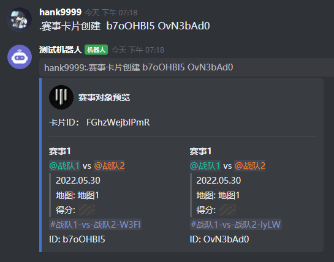

### 赛事卡片删除
---
#### 指令说明
该指令用于将已存在的赛事卡片删除  
可一次性删除多个赛事卡片  
指令 + 空格 + 赛事卡片ID ( + 空格 + 赛事卡片ID)...
#### 指令返回
删除成功消息
#### 使用示例

### 赛事卡片全部清空
---
#### 指令说明
该指令用于删除全部的赛事卡片
#### 指令返回
删除成功消息
#### 使用示例

### 赛事卡片列表
---
#### 指令说明
该指令用于列出所有的赛事卡片
#### 指令返回
一个包含所有赛事卡片信息的卡片
#### 使用示例
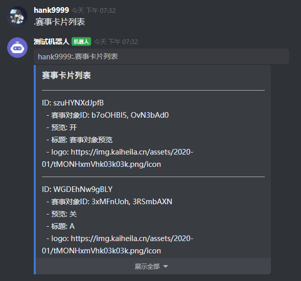

### 消息ID清空
---
#### 指令说明
该指令用于清空所有的消息ID  
[为什么要保存消息ID？](./FAQ.md#为什么要保存消息ID？)
#### 指令返回
删除成功消息
#### 使用示例

### 获取卡片ID
---
#### 指令说明
回复卡片消息获取对应的赛事卡片ID
#### 指令返回
赛事卡片ID
#### 使用示例

### 赛事卡片修改
---
#### 指令说明
有 2 种使用方式
1. 回复之前的ID相同的赛事卡片 + 关键字 ( + 内容)
2. 指令 + 空格 + 赛事卡片ID + 关键字 ( + 内容)

| 关键词 | 内容 | 用途 |
| :-: | :-: | :-: |
| 预览关 | \ | 关闭赛事卡片的预览模式 |
| 预览开 | \ | 开启赛事卡片的预览模式 |
| 标题 | 文本 | 设置赛事卡片的标题 |
| logo | 开黑啦图片链接 | 设置赛事卡片的logo |
| 添加赛事 | 赛事对象ID | 给赛事卡片添加指定赛事对象 |
| 删除赛事 | 赛事对象ID | 给赛事卡片删除指定赛事对象 |

#### 指令返回
修改成功消息
#### 使用示例
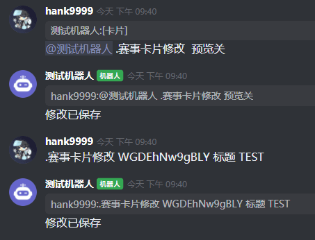

## 权限相关
[权限说明](./permissions.md)
### 编辑权限添加
---
#### 指令说明
该指令用于给指定用户添加编辑权限 
可一次性添加多名用户  
指令 + 空格 + AT用户...
#### 指令返回
添加成功消息
#### 使用示例

### 编辑权限列表
---
#### 指令说明
列出所有拥有编辑权限的用户（不包括服务器主）
#### 指令返回
包含用户信息的文本消息
#### 使用示例

### 编辑权限删除
---
#### 指令说明
删除指定用户的编辑权限  
删除指令一次只能删除一位用户
#### 指令返回
删除成功消息
#### 使用示例
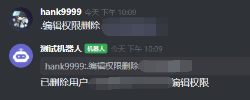

### 绑定频道权限添加
---
#### 指令说明
该指令用于给指定用户添加绑定频道权限
可一次性添加多名用户  
指令 + 空格 + AT用户...
#### 指令返回
添加成功消息
#### 使用示例

### 绑定频道权限列表
---
#### 指令说明
列出所有拥有绑定频道权限的用户（不包括服务器主）
#### 指令返回
包含用户信息的文本消息
#### 使用示例

### 绑定频道权限删除
---
#### 指令说明
删除指定用户的绑定频道权限  
删除指令一次只能删除一位用户
#### 指令返回
删除成功消息
#### 使用示例

## 频道相关
[统一发送说明](./unified_sending.md)  
[分组和频道自动创建说明](./channel_creating.md)
### 设置分组
---
#### 指令说明
在该分组的一个频道内使用该指令可设置分组
#### 指令返回
设置成功消息
#### 使用示例

### 清除分组
---
#### 指令说明
在任意频道内使用该指令可清除已设置的分组
#### 指令返回
清除成功消息
#### 使用示例

### 绑定主频道
---
#### 指令说明
在主服务器的一个频道内使用该指令可绑定主频道
#### 指令返回
设置成功消息
#### 使用示例

### 绑定频道
---
#### 指令说明
在其他服务器的一个频道内使用该指令可绑定频道
#### 指令返回
设置成功消息
#### 使用示例

### 解绑频道
---
#### 指令说明
在其他服务器的绑定频道内使用该指令可解绑频道
#### 指令返回
解绑成功消息
#### 使用示例

### 批量删除频道
---
#### 指令说明
:::danger
本指令极度高危，使用前请再三确认需要
:::
用于批量删除服务器内频道  
指令 + 空格 + #引用频道(频道ID)...  
#### 指令返回
删除成功消息
#### 使用示例
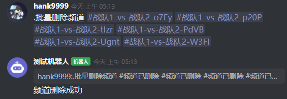

### 统一发送
---
#### 指令说明
在主服务器的一个频道内使用该指令可统一发送卡片
有 2 种使用方式
1. 回复之前的ID相同的赛事卡片
2. 指令 + 空格 + 赛事卡片ID
#### 指令行为
将指定卡片统一发送
#### 使用示例
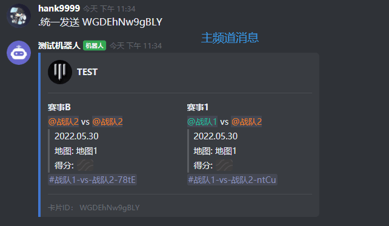
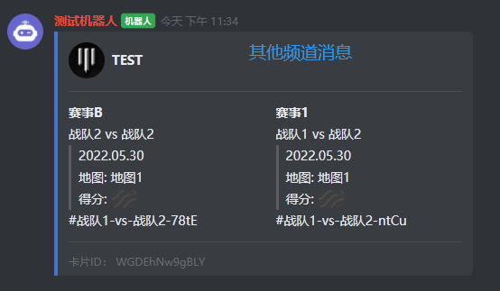
